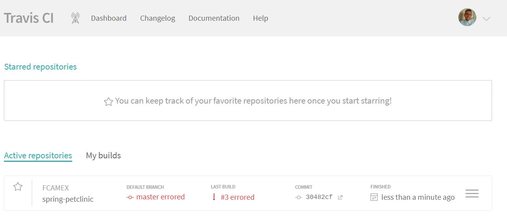
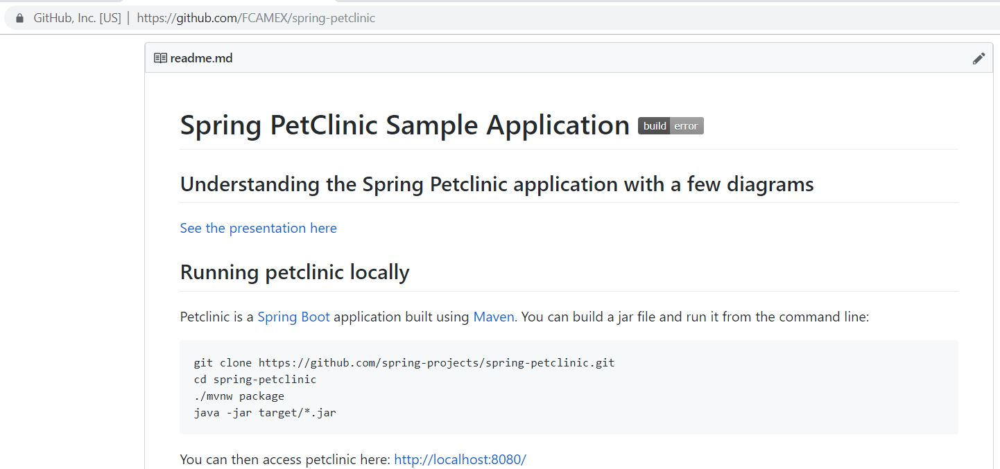

# Instructions
Fernando Araujo ID 1266517

#Docker  [50 pts]
- [5 pts] Your dockerfile. Please provide a link to this file rather than a screen capture.

[Dockerfile](https://github.com/FCAMEX/spring-petclinic/blob/master/Dockerfile)

- [5 pts] Your running docker instance as shown by a ps command.

- [5 pts] Your browser accessing the main page of the website from your local container.

#DOCKER COMPOSE - MYSQL ONLY
- [5 pts] The output from the docker-compose up command.

- [5 pts] Your browser accessing the “Veterinarians” page of the website from your local container when you run the application from the host system.

- [5 pts] A section of the stack trace generated when you attempt to run the application
container that has been updated to use MySQL.

#DOCKER COMPOSE - APP SERVER AND MYSQL
- [5 pts] Your updated docker-compose.yml file containing the application server, built from
your local Dockerfile, and the existing MySQL configuration. Please provide a link
to this file rather than a screen capture.

[docker-compose.yml](https://github.com/FCAMEX/spring-petclinic/blob/master/docker-compose.yml)

- [5 pts] Your updated application-mysql.properties file containing the URL change for
the database server. Please provide a link to this file rather than a screen capture.

[application-mysql.properties](https://github.com/FCAMEX/spring-petclinic/blob/master/src/main/resources/application-mysql.properties)

- [5 pts] The output from the docker-compose up command.

- [5 pts] Your browser accessing the “Veterinarians” page of the website from your local container.

#Travis CI  [50 pts]
- [5 pts] Your Github account showing that is has been forked from the depaulcdm/springpetclinic repository.

- [5 pts] Your Travis CI dashboard showing a successful first build.

- [5 pts] The section of the POM file showing the coordinates after you’ve changed them.

- [5 pts] Your Travis CI dashboard showing a successful build after your change of the group ID.

- [5 pts] The section of the POM file showing the coordinates after you’ve commented them out.

- [5 pts] Your Travis CI dashboard showing the unsuccessful build after the breaking change.

- [5 pts] Your Github repository with the readme.md file selected showing the build failed status after the Travis CI build fails.

- [5 pts] The section of the POM file showing the coordinates after you’ve fixed them.

- [5 pts] Your Travis CI dashboard showing the successful build after the breaking change has been fixed.

- [5 pts] Your Github repository with the readme.md file selected showing the build success status after the Travis CI build has recovered

